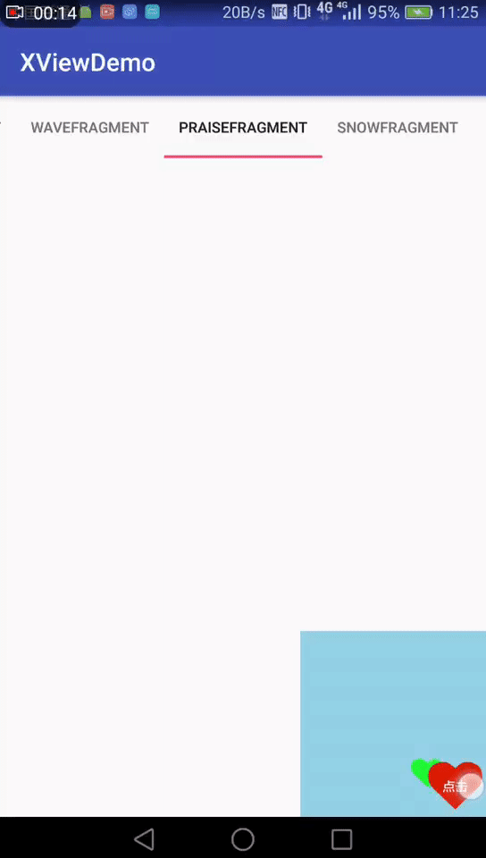

xView是一个包含有若干个自定义控件的框架，目前还在持续开发中，可以先天选已完成的功能用
===

项目引用
````gradle
compile 'com.lbx:xView:1.0.1'
````

## 1、更新说明

v1.0.1 增加了7种进度条的款式

* xWanderingCubes
* xPyramidBounds
* xRing
* xDoubleBoundsVariation
* xWheel
* xSplitCube
* xSplitCubeVariation

v1.0.2 增加了CircularReveal样式

## 2、各种进度条 XProgressBar


````Xml
<lbx.xview.views.progress.XProgressBar
                android:layout_width="80dp"
                android:layout_height="80dp"
                app:xProgressAlpha="150"
                app:xProgressColor="#ff00ff"
                app:xProgressDelay="0"
                app:xProgressDuration="800"
                app:xProgressStyle="xBound" />
````

属性 | 说明
----- | -----
xProgressAlpha  |   透明度
xProgressColor  |   颜色
xProgressDelay  |   延迟执行 毫秒
xProgressDuration  |   执行周期 毫秒
xProgressStyle  |   进度条样式style 见下表

xProgressStyle | 说明
----- | -----
xBound | 圆球进度条
xDoubleBounds | 双球进度条
xWave | 波浪进度条
xWanderingCubes | 漂浮立方体
xPyramidBounds | 三角金字塔
xRing | 流星圆环
xDoubleBoundsVariation | 双球进度条2
xWheel | 轮子进度条
xSplitCube | 拆分立方体
xSplitCubeVariation | 拆分立方体2
…… | 其他还在陆续开发中

## 3、球形波浪进度条 XWaveView


````
        <lbx.xview.views.wave.XWaveView
            android:id="@+id/waveView"
            android:layout_width="150dp"
            android:layout_height="150dp"
            app:xMinWave="2dp"
            app:xWaveArcColor="#ff00aa"
            app:xWaveArcWidth="1dp"
            app:xWaveBackground="#519b239b"
            app:xWaveColor1="#ac00aaff"
            app:xWaveColor2="#8000aaff"
            app:xWaveProgress="0"
            app:xWaveTextColor="#ffffff"
            app:xWaveTextSize="14sp" />
````

属性 | 说明
----- | -----
xMinWave | 当进度条趋于平稳时的最小波浪高度
xWaveArcColor | 圆圈边框的颜色
xWaveBackground | 圆圈的颜色
xWaveColor1 | 波浪的颜色1
xWaveColor2 | 波浪的颜色2
xWaveProgress | 进度 0~100
xWaveTextColor | 文字颜色
xWaveTextSize | 文字大小

使用：
````
    /**
     * 设置进度
     *
     * @param progress 进度
     * @param duration 动画时间
     * @param delay 延时
     */
    XWaveView.setWaveProgress(progress, 1000, 0);
    handler.sendEmptyMessageDelayed(0, 3000);
````

## 4、仿直播点赞控件 XPraiseLayout



````
<lbx.xview.views.snow.XPraiseLayout
    android:id="@+id/praiseView"
    android:layout_width="150dp"
    android:layout_height="150dp"
    android:layout_alignParentBottom="true"
    android:layout_alignParentEnd="true"
    android:background="#8841afd7"
    app:xSnowdriftDuration="2000"
    app:xSnowdriftImageSize="30dp">
````

属性 | 说明
----- | -----
xSnowdriftDuration | 动画时长
xSnowdriftImageSize | 图片大小

使用：
````
XPraiseLayout praiseLayout = view.findViewById(R.id.praiseView);
praiseLayout.setAlphaFrom(255);
praiseLayout.setAlphaTo(100);
//设置动画插值器 随机抽取
praiseLayout.setInterpolators(new LinearInterpolator(), new DecelerateInterpolator());
//设置显示的图片 随机抽取 setBitmaps setDrawables
praiseLayout.setResources(R.drawable.green_heart, R.drawable.red_heart, R.drawable.white_heart);
view.findViewById(R.id.btn_praise).setOnClickListener(v -> praiseLayout.praise());
````

## 5、雪花飘落控件 XSnowLayout


````
<lbx.xview.views.snow.XSnowLayout
    android:id="@+id/snowLayout"
    android:layout_width="match_parent"
    android:layout_height="200dp"
    android:background="#8841afd7"
    app:xSnowdriftAccumulation="0"
    app:xSnowdriftDuration="5000"
    app:xSnowdriftImageSize="80px"
    app:xSnowdriftSpeed="300">
</lbx.xview.views.snow.XSnowLayout>
````

属性 | 说明
----- | -----
xSnowdriftAccumulation | 设置堆积量(雪花飘到底部不会消失)
xSnowdriftDuration | 飘落时间、毫秒
xSnowdriftImageSize | 图片(雪花)大小
xSnowdriftSpeed | 图片(雪花)飘落速度、毫秒

使用:
````
//设置图片  每个雪花会随机抽取其中一个
snowLayout.setResources(R.drawable.red_heart, R.drawable.green_heart, R.drawable.white_heart);

//设置插值器  每个雪花会随机抽取其中一个
snowLayout.setInterpolators(new LinearInterpolator(), new DecelerateInterpolator(), new AccelerateDecelerateInterpolator());

//起始透明度 0~255
snowLayout.setAlphaFrom(float);

//终点透明度 0~255
snowLayout.setAlphaFrom(float);

//设置大小
snowLayout.setImageSize(int);

//设置堆积量
snowLayout.setAccumulation(int);

//设置发射速度,毫秒,如100,则100毫秒发射一片雪花
snowLayout.setSpeed(int);

//设置飘落速度,毫秒,如100,则从顶部飘到底部的时间是100毫秒
snowLayout.setDuration(int);

//开始动画
snowLayout.startAnimation();

//结束动画
snowLayout.cancelAnimation();

````

## 6、盒子控件 XFloodLayout


````
<lbx.xview.views.flood.XFloodLayout
    android:id="@+id/floodView"
    android:layout_width="match_parent"
    android:layout_height="0dp"
    android:layout_weight="1">
</lbx.xview.views.flood.XFloodLayout>
````

使用:
````
//是否打开
floodLayout.isFlood()

 //打开
 floodLayout.flood(500, new AccelerateInterpolator());
 
 //关闭
 floodLayout.unFlood(500, new DecelerateInterpolator());
 
 //设置监听回调
 floodLayout.setOnFloodUpdateListener(listener);
````

## 7、CircularReveal样式

### 7.1 启动一个CircularReveal样式的Activity


在第一个页面获取Intent：

````Java
        Intent intent = CircularRevealUtils.ActivityCircularReveal()
                .makeCircularRevealIntent(this,
                        CircularRevealActivity.class,
                        (int) event.getX(),
                        (int) event.getY());
        startActivity(intent);
````

CircularRevealActivity中的逻辑：
* 首先，需要在AndroidManifest文件中，给被跳转页面设置属性：
android:theme="@style/CircularRevealAnimTheme"
* 接着，需要实现接口 ICircularReveal，其中getActivity()返回为当前的Activity，
getRootView()返回为xml中的根布局，本框架会使用根布局做动画效果。
* 然后再OnCreate方法里：
````Java
CircularRevealUtils.ActivityCircularReveal().setCircularRevealAnim(this, false);
````
* 如果返回键需要动画效果：
````Java
    @Override
    public void onBackPressed() {
        CircularRevealUtils.ActivityCircularReveal().onBackPressed(this, 500, 500, null);
    }
````

* 如果点击某个按钮关闭页面，则以按钮为中心做动画：
````Java
        CircularRevealUtils.ActivityCircularReveal().setCircularRevealAnim(
                this, x, y, true);
````

### 7.2 点击Button显示一个CircularReveal样式的View

````Java
        if (secondView.getVisibility() == View.INVISIBLE) {
            CircularRevealUtils.ViewCircularRevealUtil().showFloatingViewByClickView(v, secondView);
        } else {
            CircularRevealUtils.ViewCircularRevealUtil().goneFloatingViewByClickView(v, secondView);
        }
````

### 7.3 点击Button显示一个CircularReveal样式的卡片

* 首先页面需要实现IMaterial接口，其中getFloatingButton()返回动画按钮，
getTopView()返回动画后需要显示的页面，getBottomView()返回动画前默认的页面，
getTopChildView()返回动画后需要显示的页面则子View，动画完成后显示这些子View，
给用户良好的动画视觉体验。
* 然后通过下方方法控制卡片显示与隐藏:
````Java
//显示
CircularRevealUtils.MaterialUtil(this).launchTwitter(context);
//隐藏
CircularRevealUtils.MaterialUtil(this).closeTwitter(context);
````

### 7.4 Button与ProgressBar的转换

控件： lbx.xview.views.circular_reveal.CircularButton ,其实就是原生的
Button与ProgressBar做的动画，可以使用
CircularButton#change(CircularButton.CircularButtonStyle)方法进行转换。